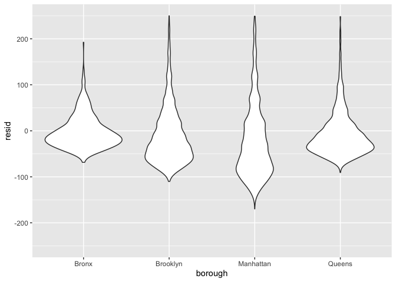

linear_models
================
Emily Potts
2022-11-10

# model fitting

``` r
data("nyc_airbnb")

nyc_airbnb = 
  nyc_airbnb %>% 
  mutate(stars = review_scores_location / 2) %>% 
  rename(
    borough = neighbourhood_group,
    neighborhood = neighbourhood) %>% 
  filter(borough != "Staten Island") %>% 
  select(price, stars, borough, neighborhood, room_type)
```

``` r
fit = lm(price ~ stars + borough, data = nyc_airbnb)

summary(fit)
```

    ## 
    ## Call:
    ## lm(formula = price ~ stars + borough, data = nyc_airbnb)
    ## 
    ## Residuals:
    ##    Min     1Q Median     3Q    Max 
    ## -169.8  -64.0  -29.0   20.2 9870.0 
    ## 
    ## Coefficients:
    ##                  Estimate Std. Error t value Pr(>|t|)    
    ## (Intercept)       -70.414     14.021  -5.022 5.14e-07 ***
    ## stars              31.990      2.527  12.657  < 2e-16 ***
    ## boroughBrooklyn    40.500      8.559   4.732 2.23e-06 ***
    ## boroughManhattan   90.254      8.567  10.534  < 2e-16 ***
    ## boroughQueens      13.206      9.065   1.457    0.145    
    ## ---
    ## Signif. codes:  0 '***' 0.001 '**' 0.01 '*' 0.05 '.' 0.1 ' ' 1
    ## 
    ## Residual standard error: 181.5 on 30525 degrees of freedom
    ##   (9962 observations deleted due to missingness)
    ## Multiple R-squared:  0.03423,    Adjusted R-squared:  0.03411 
    ## F-statistic: 270.5 on 4 and 30525 DF,  p-value: < 2.2e-16

``` r
fit %>% 
  broom::tidy() %>% 
  mutate(
    term = str_replace(term, "borough", "Borough: ")
  ) %>% 
  select(term, estimate, p.value) %>% 
  knitr::kable(digits = 2)
```

| term               | estimate | p.value |
|:-------------------|---------:|--------:|
| (Intercept)        |   -70.41 |    0.00 |
| stars              |    31.99 |    0.00 |
| Borough: Brooklyn  |    40.50 |    0.00 |
| Borough: Manhattan |    90.25 |    0.00 |
| Borough: Queens    |    13.21 |    0.15 |

changing reference categories

``` r
change_ref_fit = 
  nyc_airbnb %>% 
  mutate(
    borough = fct_infreq(borough)
  ) %>% 
  lm(price ~ stars + borough, data = .) %>% 
broom::tidy() %>% 
  mutate(
    term = str_replace(term, "borough", "Borough: ")
  ) %>% 
  select(term, estimate, p.value) %>% 
  knitr::kable(digits = 2)
fit
```

    ## 
    ## Call:
    ## lm(formula = price ~ stars + borough, data = nyc_airbnb)
    ## 
    ## Coefficients:
    ##      (Intercept)             stars   boroughBrooklyn  boroughManhattan  
    ##           -70.41             31.99             40.50             90.25  
    ##    boroughQueens  
    ##            13.21

``` r
fit %>% 
  broom::glance()
```

    ## # A tibble: 1 × 12
    ##   r.squared adj.r.…¹ sigma stati…²   p.value    df  logLik    AIC    BIC devia…³
    ##       <dbl>    <dbl> <dbl>   <dbl>     <dbl> <dbl>   <dbl>  <dbl>  <dbl>   <dbl>
    ## 1    0.0342   0.0341  182.    271. 6.73e-229     4 -2.02e5 4.04e5 4.04e5  1.01e9
    ## # … with 2 more variables: df.residual <int>, nobs <int>, and abbreviated
    ## #   variable names ¹​adj.r.squared, ²​statistic, ³​deviance

# diagnostics

``` r
modelr::add_residuals(nyc_airbnb, fit) %>% 
  ggplot(aes(x = stars, y = resid)) + geom_point()
```

    ## Warning: Removed 9962 rows containing missing values (geom_point).

<!-- -->

``` r
modelr::add_residuals(nyc_airbnb, fit) %>% 
  ggplot(aes(x = borough, y = resid)) + geom_violin() + ylim(-250, 250)
```

    ## Warning: Removed 10862 rows containing non-finite values (stat_ydensity).

<!-- -->

# hypothesis testing

one coefficient (stars)

``` r
fit_null = lm(price ~ stars, data = nyc_airbnb)

fit_alt = lm(price ~ stars + borough, data = nyc_airbnb)

anova(fit_null, fit_alt) %>% 
  broom::tidy()
```

    ## Warning: Unknown or uninitialised column: `term`.

    ## # A tibble: 2 × 7
    ##   term                    df.residual       rss    df   sumsq stati…¹    p.value
    ##   <chr>                         <dbl>     <dbl> <dbl>   <dbl>   <dbl>      <dbl>
    ## 1 price ~ stars                 30528    1.03e9    NA NA          NA  NA        
    ## 2 price ~ stars + borough       30525    1.01e9     3  2.53e7    256.  7.84e-164
    ## # … with abbreviated variable name ¹​statistic

room type by borough

``` r
nest_lm_res =
  nyc_airbnb %>% 
  nest(df = -borough) %>% 
  mutate(
    models = map(.x = df, ~lm(price ~ stars + room_type, data = .x)),
    results = map(models, broom::tidy)) %>% 
  select(-df, -models) %>% 
  unnest(results)


nest_lm_res %>% 
  select(borough, term, estimate) %>% 
  mutate(term = fct_inorder(term)) %>% 
  pivot_wider(
    names_from = term, values_from = estimate) %>% 
  knitr::kable(digits = 3)
```

| borough   | (Intercept) |  stars | room_typePrivate room | room_typeShared room |
|:----------|------------:|-------:|----------------------:|---------------------:|
| Bronx     |      90.067 |  4.446 |               -52.915 |              -70.547 |
| Queens    |      91.575 |  9.654 |               -69.255 |              -94.973 |
| Brooklyn  |      69.627 | 20.971 |               -92.223 |             -105.839 |
| Manhattan |      95.694 | 27.110 |              -124.188 |             -153.635 |

``` r
nyc_airbnb %>% 
  filter(borough == "Bronx") %>% 
  lm(price ~ stars + room_type, data = .) %>% 
  broom::tidy()
```

    ## # A tibble: 4 × 5
    ##   term                  estimate std.error statistic  p.value
    ##   <chr>                    <dbl>     <dbl>     <dbl>    <dbl>
    ## 1 (Intercept)              90.1      15.2       5.94 5.73e- 9
    ## 2 stars                     4.45      3.35      1.33 1.85e- 1
    ## 3 room_typePrivate room   -52.9       3.57    -14.8  6.21e-41
    ## 4 room_typeShared room    -70.5       8.36     -8.44 4.16e-16
